# BAO CAO PROJECT: TICH HOP EASYCWMP VAO OPENWRT VA KIEM THU VOI GENIEACS


## Tom tat

Project thuc hien tich hop `easycwmp` vao OpenWrt de bien board OpenWrt thanh mot CPE TR-069 co the ket noi toi ACS. ACS duoc su dung trong qua trinh test la GenieACS. Qua trinh thuc hien bao gom:

- Them package `easycwmp` vao OpenWrt build system.
- Them thu vien `libmicroxml` tu source ngoai vao `package/libs/libmicroxml`.
- Sua loi build cua EasyCwmp tren toolchain OpenWrt hien tai.
- Build thanh cong firmware va `.ipk`.
- Cai dat va cau hinh EasyCwmp tren board OpenWrt.
- Kiem thu local CLI, daemon, CWMP RPC, Connection Request, GenieACS task va cac data model TR-181 da import.

Ket qua chinh:

- Build tao duoc `easycwmp_1.8.6_mipsel_24kc.ipk`.
- Build tao duoc `libmicroxml1_1.0-r1_mipsel_24kc.ipk`.
- EasyCwmp daemon chay tren board voi process `/usr/sbin/easycwmpd -f --boot`.
- Board expose data model `Device.*` gom `DeviceInfo`, `DHCPv4`, `IP`, `ManagementServer`, `WiFi`, `IPPingDiagnostics`.
- ACS co the get/set parameter thong qua task CWMP.
- Da xac dinh va sua cac loi build/runtime quan trong: duplicate `AM_INIT_AUTOMAKE`, thieu `libmicroxml`, multiple definition `event_code_array`, sai cu phap `uci show -X` khi browse instance.

---

## 1. Gioi thieu de tai

### 1.1. Ly do chon de tai

TR-069 la giao thuc duoc dung rong rai de quan ly CPE tu xa, dac biet trong modem/router, gateway va thiet bi IoT mang. OpenWrt la he dieu hanh router ma nguon mo pho bien, co he thong package linh hoat, phu hop de tich hop mot CWMP client nhu EasyCwmp.

Viec tich hop EasyCwmp vao OpenWrt giup:

- Quan ly thiet bi tu xa qua ACS.
- Tu dong cau hinh ACS URL, periodic inform, WiFi, DHCP, IP.
- Kiem thu kha nang mapping giua TR-181 data model va UCI/ubus cua OpenWrt.
- Hieu ro quy trinh dua mot phan mem open source vao OpenWrt build system.

### 1.2. Muc tieu

Muc tieu cua project:

- Build thanh cong EasyCwmp trong source OpenWrt.
- Dung `libmicroxml` lay tu source ngoai.
- Cai dat EasyCwmp len board OpenWrt.
- Cau hinh board ket noi GenieACS.
- Kiem thu tat ca tinh nang EasyCwmp co trong source/package da import.
- Lap tai lieu bao cao co diagram va test case day du.

---

## 2. Moi truong thuc hien

### 2.1. Build VM

| Thanh phan | Gia tri |
|---|---|
| VM IP | `192.168.19.128` |
| User | `tungnt254` |
| OpenWrt source | `/home/tungnt254/Documents/Fasttrack_mock/openwrt` |
| Target | `ramips/mt76x8` |
| ABI/package arch | `mipsel_24kc` |

### 2.2. Board OpenWrt

| Thanh phan | Gia tri |
|---|---|
| Board IP | `192.168.2.1` |
| User | `root` |
| LAN interface | `br-lan` |
| LAN IP | `192.168.2.1/24` |
| EasyCwmp process | `/usr/sbin/easycwmpd -f --boot` |

### 2.3. ACS

Theo config hien tai tren board:

```sh
easycwmp.@acs[0].url='http://192.168.2.144:7547'
easycwmp.@acs[0].username='admin'
easycwmp.@acs[0].password='admin'
easycwmp.@acs[0].periodic_enable='1'
easycwmp.@acs[0].periodic_interval='100'
```

---

## 3. Tong quan cong nghe

### 3.1. TR-069/CWMP

TR-069 dinh nghia co che ACS quan ly CPE qua SOAP/HTTP. CPE chu dong tao CWMP session toi ACS. ACS co the tra ve RPC trong cung session de get/set parameter, reboot, download firmware, hoac yeu cau diagnostic.

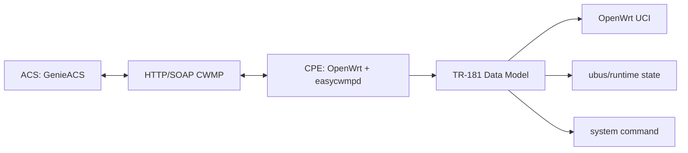

### 3.2. EasyCwmp

EasyCwmp gom:

- Daemon C: `easycwmpd`, xu ly HTTP, SOAP, CWMP event, ACS session.
- External script: `/usr/sbin/easycwmp`, cung cap CLI va JSON pipe cho daemon.
- Data model scripts: `/usr/share/easycwmp/functions/*`, map TR-181 parameter sang UCI/ubus.

### 3.3. GenieACS

GenieACS la ACS open source. Trong project nay GenieACS duoc dung de:

- Nhan `Inform` tu board.
- Tao task `GetParameterValues`, `SetParameterValues`, `GetParameterNames`.
- Test Connection Request toi board.
- Quan sat value trong data model.

---

## 4. Cau truc source OpenWrt sau khi tich hop

### 4.1. Package EasyCwmp

Source package:

```text
package/easycwmp/
├── Config.in
├── Makefile
└── patches/
    └── 001-fix-duplicate-automake-init.patch
```

Thong tin trong `package/easycwmp/Makefile`:

```make
PKG_NAME:=easycwmp
PKG_VERSION:=1.8.6
PKG_SOURCE:=easycwmp-1.8.6.tar.gz
PKG_SOURCE_URL:=https://easycwmp.org/wp-content/uploads/2025/08/
PKG_FIXUP:=autoreconf
```

Phu thuoc:

```make
DEPENDS:=+libubus +libuci +libubox +libmicroxml +libjson-c +libcurl +curl
```

Lua chon data model:

```text
CONFIG_EASYCWMP_SCRIPTS_FULL
CONFIG_EASYCWMP_DATA_MODEL_TR181
CONFIG_EASYCWMP_DATA_MODEL_TR98
```

Trong project nay runtime tren board dang chay TR-181, the hien qua root object `Device.`.

### 4.2. Package libmicroxml

Source package:

```text
package/libs/libmicroxml/
├── Config.in
└── Makefile
```

Thong tin trong `package/libs/libmicroxml/Makefile`:

```make
PKG_NAME:=libmicroxml
PKG_VERSION:=1.0
PKG_SOURCE_PROTO:=git
PKG_SOURCE_URL:=https://github.com/pivasoftware/microxml.git
PKG_SOURCE_VERSION:=80a15162f3a8318c70e8688d8ecbfc38676bd9a2
PKG_FIXUP:=autoreconf
```

Package nay install:

- Header: `microxml.h`
- Shared library: `libmicroxml.so*`
- pkg-config file: `microxml.pc`

### 4.3. File runtime tren board

Theo `opkg files easycwmp`, package cai cac file:

```text
/usr/sbin/easycwmp
/usr/sbin/easycwmpd
/etc/config/easycwmp
/etc/init.d/easycwmpd
/usr/share/easycwmp/defaults
/usr/share/easycwmp/functions/root
/usr/share/easycwmp/functions/common
/usr/share/easycwmp/functions/device_info
/usr/share/easycwmp/functions/dhcpv4
/usr/share/easycwmp/functions/ip
/usr/share/easycwmp/functions/ipping_diagnostic
/usr/share/easycwmp/functions/ipping_launch
/usr/share/easycwmp/functions/management_server
/usr/share/easycwmp/functions/wifi
```

---

## 5. Kien truc he thong

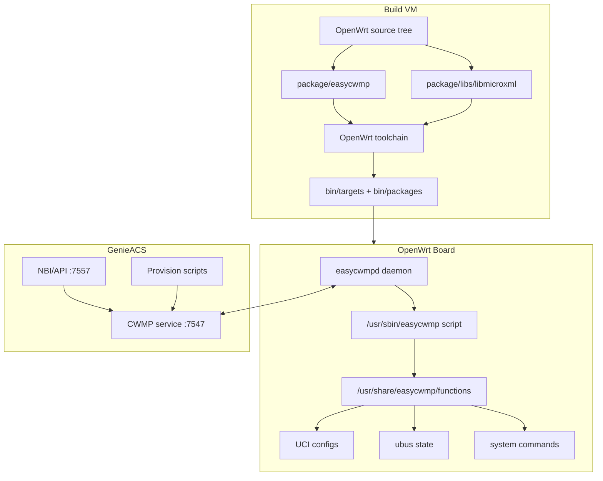

---

## 6. Quy trinh build

### 6.1. Build flow

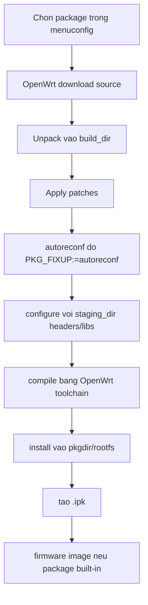

### 6.2. Build commands

```sh
cd /home/tungnt254/Documents/Fasttrack_mock/openwrt
make package/libs/libmicroxml/compile V=s -j1
make package/easycwmp/compile V=s -j1
make -j$(nproc)
```

### 6.3. Output package/firmware

Ket qua build da xac nhan:

```text
bin/packages/mipsel_24kc/base/easycwmp_1.8.6_mipsel_24kc.ipk
bin/packages/mipsel_24kc/base/libmicroxml1_1.0-r1_mipsel_24kc.ipk
bin/targets/ramips/mt76x8/openwrt-ramips-mt76x8-mediatek_linkit-smart-7688-initramfs-kernel.bin
bin/targets/ramips/mt76x8/openwrt-ramips-mt76x8-mediatek_linkit-smart-7688-squashfs-sysupgrade.bin
```

---

## 7. Cac loi build va cach xu ly

### 7.1. Duplicate `AM_INIT_AUTOMAKE`

Patch trong source:

```diff
 AC_INIT([easycwmpd], [1.8.6], [mohamed.kallel@pivasoftware.com])
-AM_INIT_AUTOMAKE
 AC_CONFIG_SRCDIR([src/easycwmp.c])
-
 AM_INIT_AUTOMAKE([subdir-objects])
```

Nguyen nhan:

- `configure.ac` co hai lan goi `AM_INIT_AUTOMAKE`.
- `autoreconf` fail, nhung build log ban dau de gay nham lan thanh loi Makefile.

Ket qua:

- Sau khi xoa duplicate macro, `autoreconf` co the sinh configure/makefile dung.

### 7.2. Thieu `libmicroxml`

Nguyen nhan:

- EasyCwmp can XML parser `libmicroxml`.
- Source OpenWrt ban dau chua co package thu vien nay.

Cach xu ly:

- Them `package/libs/libmicroxml`.
- Them `+libmicroxml` vao `DEPENDS` cua EasyCwmp.
- Them `Build/InstallDev` de package EasyCwmp link duoc header va library trong staging.

### 7.3. Multiple definition `event_code_array`

Patch:

```diff
-struct event_code event_code_array[__EVENT_MAX];
+extern struct event_code event_code_array[__EVENT_MAX];
```

Nguyen nhan:

- Header `cwmp.h` define bien global thay vi declare.
- GCC/toolchain moi mac dinh `-fno-common`, dan den multiple definition khi link.

Ket qua:

- `event_code_array` chi duoc define that trong `cwmp.c`.
- Header chi khai bao `extern`.

---

## 8. Kien truc source C cua daemon

### 8.1. Cac file source chinh

Source C trong build dir:

```text
src/easycwmp.c
src/config.c
src/cwmp.c
src/http.c
src/xml.c
src/external.c
src/json.c
src/ubus.c
src/backup.c
src/basicauth.c
src/digestauth.c
```

Vai tro:

| File | Vai tro |
|---|---|
| `easycwmp.c` | Entry point daemon, init config, uloop, ubus/http |
| `config.c` | Doc `/etc/config/easycwmp`, UCI get/set, reload |
| `cwmp.c` | Quan ly event, Inform, retry, session, download/upload timers |
| `http.c` | HTTP client toi ACS va HTTP server Connection Request |
| `xml.c` | Tao/parse SOAP/CWMP XML, handle RPC |
| `external.c` | Fork/pipe toi `/usr/sbin/easycwmp`, gui command JSON |
| `json.c` | Parse JSON output tu script shell |
| `ubus.c` | ubus integration |
| `backup.c` | Luu event/transfer complete khi can backup |
| `basicauth.c`, `digestauth.c` | Xac thuc HTTP Connection Request |

### 8.2. CWMP session flow

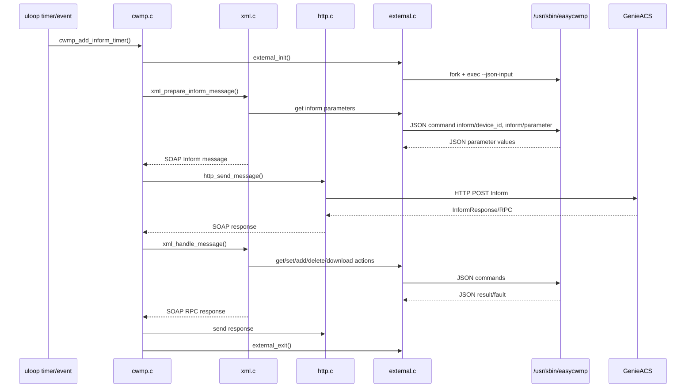

### 8.3. External script bridge

`external.c` fork script:

```text
/usr/sbin/easycwmp --json-input
```

Sau do daemon gui JSON qua pipe:

```json
{"command":"get","class":"value","parameter":"Device.ManagementServer.URL"}
{"command":"set","class":"value","parameter":"Device.ManagementServer.PeriodicInformInterval","argument":"300"}
{"command":"apply","class":"value","argument":"<ParameterKey>"}
```

Script tra ve tung dong JSON:

```json
{ "parameter": "Device.ManagementServer.URL", "value": "http://192.168.2.144:7547" }
```

---

## 9. Kien truc script `/usr/sbin/easycwmp`

### 9.1. Command support

Usage cua script cho thay cac action:

```text
get [value|notification|name]
set [value|notification]
apply [value|notification|object|service]
add [object]
delete [object]
download
upload
factory_reset
reboot
inform [parameter|device_id]
--json-input
```

### 9.2. Script startup flow

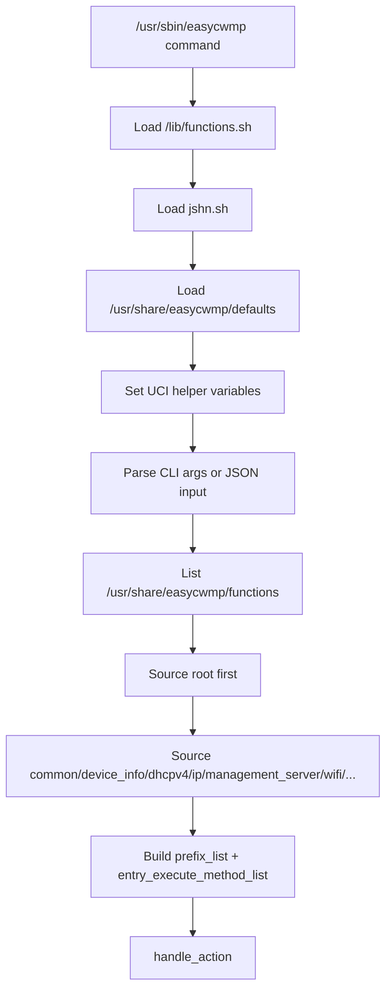

### 9.3. Common dispatch flow

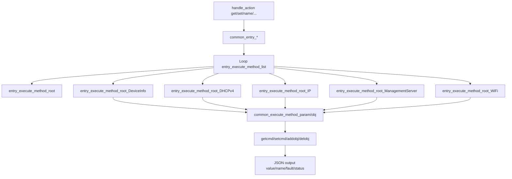

### 9.4. Apply value flow

`set value` khong commit ngay. Script ghi command vao temp file, sau do `apply value` moi execute va commit UCI.

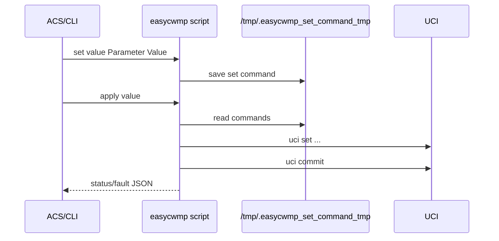

---

## 10. RPC duoc source ho tro

Trong `xml.c`, EasyCwmp co handler cho cac RPC:

| RPC | Source behavior |
|---|---|
| `Inform` | Tao Inform message tu DeviceID, events, forced inform params |
| `GetRPCMethods` | Gui RPC toi ACS de lay method ACS support |
| `TransferComplete` | Gui ket qua download/upload |
| `GetParameterValues` | Goi external `get value` |
| `SetParameterValues` | Goi external `set value`, sau do `apply value` |
| `GetParameterNames` | Goi external `get name` |
| `GetParameterAttributes` | Goi external `get notification` |
| `SetParameterAttributes` | Goi external `set notification`, sau do `apply notification` |
| `Download` | Luu request, launch download, apply theo file type |
| `Upload` | Upload log/config file |
| `FactoryReset` | Tra response roi factory reset cuoi session |
| `Reboot` | Tra response roi reboot cuoi session |
| `ScheduleInform` | Dat timer inform sau delay |
| `AddObject` | Goi external `add object`, sau do `apply object` |
| `DeleteObject` | Goi external `delete object`, sau do `apply object` |

RPC flow chung:

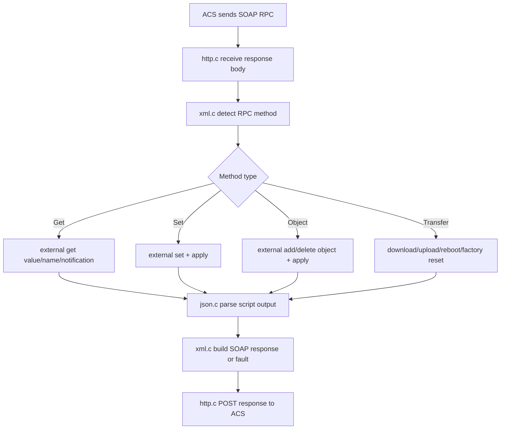

---

## 11. Data model TR-181 da import

### 11.1. Root data model tren board

Lenh:

```sh
easycwmp get name Device. 0
```

Board hien expose cac nhom:

```text
Device.DeviceInfo.
Device.DHCPv4.
Device.IP.
Device.IP.Diagnostics.IPPing.
Device.ManagementServer.
Device.WiFi.
```

### 11.2. Data model dependency diagram

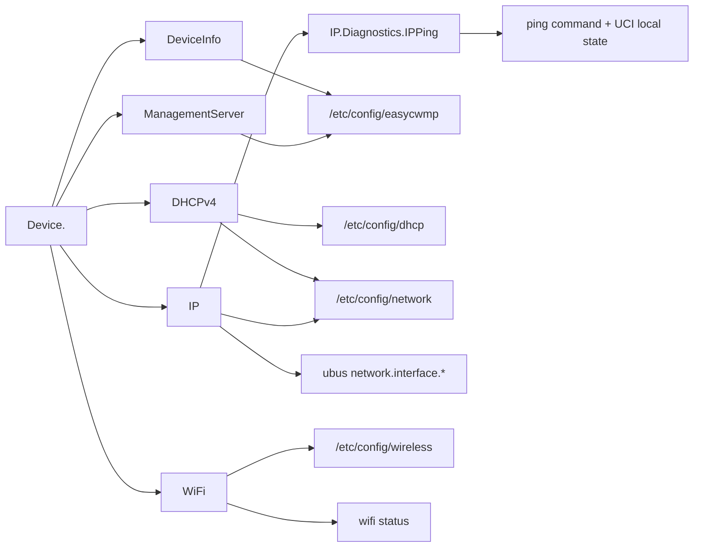

### 11.3. DeviceInfo

Dang ky trong `functions/device_info`.

Parameters:

| Parameter | Writable | Source |
|---|---:|---|
| `Device.DeviceInfo.SpecVersion` | 0 | hardcode `1.0` |
| `Device.DeviceInfo.ProvisioningCode` | 1 | `easycwmp.@local[0].provisioning_code` |
| `Device.DeviceInfo.Manufacturer` | 0 | `easycwmp.@device[0].manufacturer` |
| `Device.DeviceInfo.ManufacturerOUI` | 0 | `easycwmp.@device[0].oui` |
| `Device.DeviceInfo.ProductClass` | 0 | `easycwmp.@device[0].product_class` |
| `Device.DeviceInfo.SerialNumber` | 0 | `easycwmp.@device[0].serial_number` |
| `Device.DeviceInfo.HardwareVersion` | 0 | `easycwmp.@device[0].hardware_version` |
| `Device.DeviceInfo.SoftwareVersion` | 0 | `easycwmp.@device[0].software_version` |
| `Device.DeviceInfo.UpTime` | 0 | `/proc/uptime` |
| `Device.DeviceInfo.DeviceLog` | 0 | `dmesg | tail -n1` |
| `Device.DeviceInfo.MemoryStatus.Total` | 0 | `/proc/meminfo` |
| `Device.DeviceInfo.MemoryStatus.Free` | 0 | `/proc/meminfo` |

### 11.4. ManagementServer

Dang ky trong `functions/management_server`.

Parameters:

| Parameter | Writable | Source |
|---|---:|---|
| `Device.ManagementServer.URL` | 1 | `easycwmp.@acs[0].url` |
| `Device.ManagementServer.Username` | 1 | `easycwmp.@acs[0].username` |
| `Device.ManagementServer.Password` | 1 | write-only setter |
| `Device.ManagementServer.PeriodicInformEnable` | 1 | `easycwmp.@acs[0].periodic_enable` |
| `Device.ManagementServer.PeriodicInformInterval` | 1 | `easycwmp.@acs[0].periodic_interval` |
| `Device.ManagementServer.PeriodicInformTime` | 1 | `easycwmp.@acs[0].periodic_time` |
| `Device.ManagementServer.ConnectionRequestURL` | 0 | built tu interface + port |
| `Device.ManagementServer.ConnectionRequestUsername` | 1 | `easycwmp.@local[0].username` |
| `Device.ManagementServer.ConnectionRequestPassword` | 1 | write-only setter |
| `Device.ManagementServer.ParameterKey` | 0 | `easycwmp.@acs[0].parameter_key` |

Connection Request URL flow:

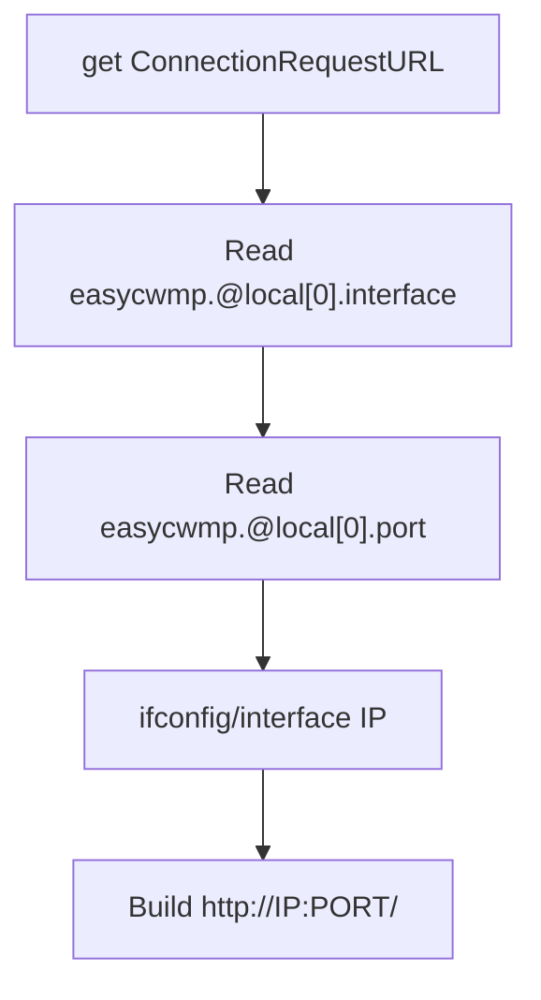

Voi board hien tai, interface phai la:

```sh
easycwmp.@local[0].interface='br-lan'
```

### 11.5. DHCPv4

Dang ky trong `functions/dhcpv4`.

Object/parameter:

| Object/Parameter | Writable |
|---|---:|
| `Device.DHCPv4.` | 0 |
| `Device.DHCPv4.Server.` | 0 |
| `Device.DHCPv4.Server.Enable` | 1 |
| `Device.DHCPv4.Server.Pool.` | 1 |
| `Device.DHCPv4.Server.Pool.{i}.Enable` | 1 |
| `Device.DHCPv4.Server.Pool.{i}.Status` | 0 |
| `Device.DHCPv4.Server.Pool.{i}.Interface` | 1 |
| `Device.DHCPv4.Server.Pool.{i}.MinAddress` | 1 |
| `Device.DHCPv4.Server.Pool.{i}.MaxAddress` | 1 |
| `Device.DHCPv4.Server.Pool.{i}.SubnetMask` | 1 |
| `Device.DHCPv4.Server.Pool.{i}.DNSServers` | 1 |
| `Device.DHCPv4.Server.Pool.{i}.IPRouters` | 1 |
| `Device.DHCPv4.Server.Pool.{i}.LeaseTime` | 1 |

Browse instance flow:

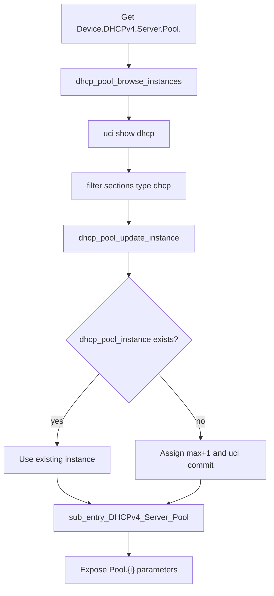

Trang thai board hien tai:

```text
dhcp.lan.dhcp_pool_instance='1'
dhcp.wan.dhcp_pool_instance='2'
```

Vi vay `get name Device.DHCPv4.Server.Pool. 0` da hien `Pool.1` va `Pool.2`.

### 11.6. IP

Dang ky trong `functions/ip`.

Object/parameter chinh:

| Object/Parameter | Writable |
|---|---:|
| `Device.IP.` | 0 |
| `Device.IP.Interface.` | 1 |
| `Device.IP.Interface.{i}.Enable` | 0 |
| `Device.IP.Interface.{i}.Name` | 0 |
| `Device.IP.Interface.{i}.Type` | 0 |
| `Device.IP.Interface.{i}.IPv4AddressNumberOfEntries` | 0 |
| `Device.IP.Interface.{i}.IPv4Address.1.IPAddress` | 1 |
| `Device.IP.Interface.{i}.IPv4Address.1.AddressingType` | 0 |
| `Device.IP.Interface.{i}.IPv4Address.1.Enable` | 0 |
| `Device.IP.Interface.{i}.IPv4Address.1.SubnetMask` | 0 |
| `Device.IP.Interface.{i}.Stats.*` | 0 |

Board hien co:

```text
network.loopback.ip_int_instance='1'
network.lan.ip_int_instance='2'
```

IP interface flow:

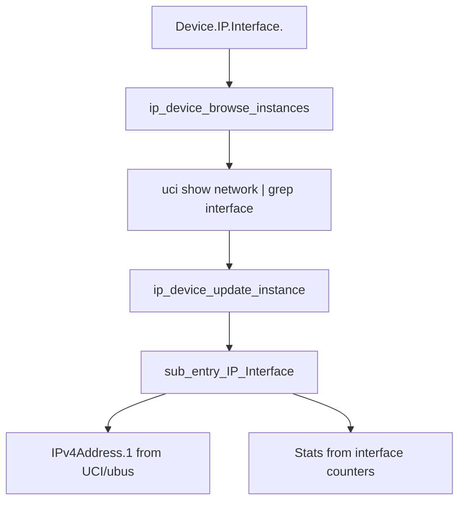

### 11.7. IPPingDiagnostics

Dang ky trong `functions/ipping_diagnostic`, duoc goi thong qua `functions/ip`.

Parameters:

| Parameter | Writable |
|---|---:|
| `Device.IP.Diagnostics.IPPing.DiagnosticsState` | 1 |
| `Device.IP.Diagnostics.IPPing.Host` | 1 |
| `Device.IP.Diagnostics.IPPing.NumberOfRepetitions` | 1 |
| `Device.IP.Diagnostics.IPPing.Timeout` | 1 |
| `Device.IP.Diagnostics.IPPing.DataBlockSize` | 1 |
| `Device.IP.Diagnostics.IPPing.SuccessCount` | 0 |
| `Device.IP.Diagnostics.IPPing.FailureCount` | 0 |
| `Device.IP.Diagnostics.IPPing.AverageResponseTime` | 0 |
| `Device.IP.Diagnostics.IPPing.MinimumResponseTime` | 0 |
| `Device.IP.Diagnostics.IPPing.MaximumResponseTime` | 0 |

Diagnostic flow:

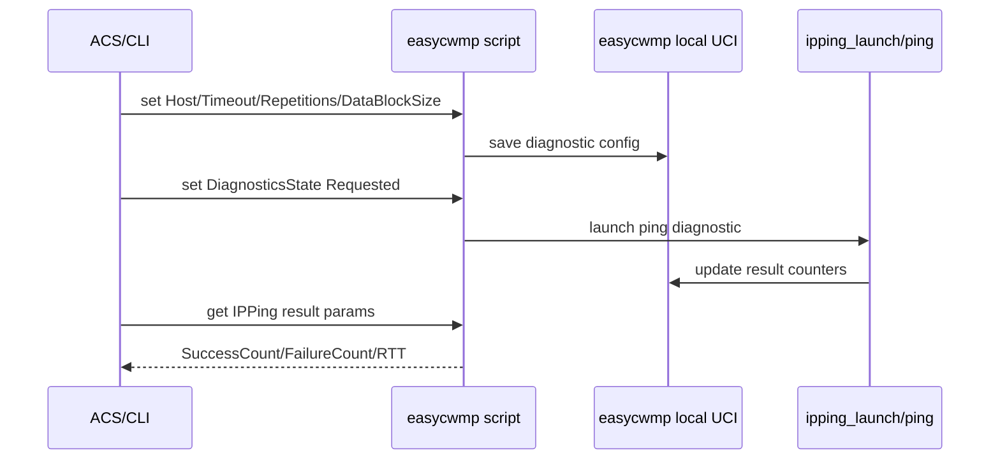

### 11.8. WiFi

Dang ky trong `functions/wifi`.

Object chinh:

| Object | Description |
|---|---|
| `Device.WiFi.Radio.{i}` | Radio wifi-device |
| `Device.WiFi.SSID.{i}` | WiFi iface/SSID |
| `Device.WiFi.AccessPoint.{i}` | AP object gan voi SSID |
| `Device.WiFi.AccessPoint.{i}.Security` | Security settings |

Parameter chinh:

| Parameter | Writable |
|---|---:|
| `Device.WiFi.Radio.{i}.Enable` | 1 |
| `Device.WiFi.Radio.{i}.Status` | 0 |
| `Device.WiFi.Radio.{i}.Channel` | 1 |
| `Device.WiFi.Radio.{i}.AutoChannelEnable` | 1 |
| `Device.WiFi.Radio.{i}.OperatingStandards` | 1 |
| `Device.WiFi.SSID.{i}.Enable` | 1 |
| `Device.WiFi.SSID.{i}.LowerLayers` | 1 |
| `Device.WiFi.SSID.{i}.SSID` | 1 |
| `Device.WiFi.SSID.{i}.X_IPInterface` | 1 |
| `Device.WiFi.AccessPoint.{i}.Enable` | 1 |
| `Device.WiFi.AccessPoint.{i}.Security.ModeEnabled` | 1 |
| `Device.WiFi.AccessPoint.{i}.Security.WEPKey` | 1 |
| `Device.WiFi.AccessPoint.{i}.Security.PreSharedKey` | 1 |
| `Device.WiFi.AccessPoint.{i}.Security.KeyPassphrase` | 1 |

WiFi browse flow:

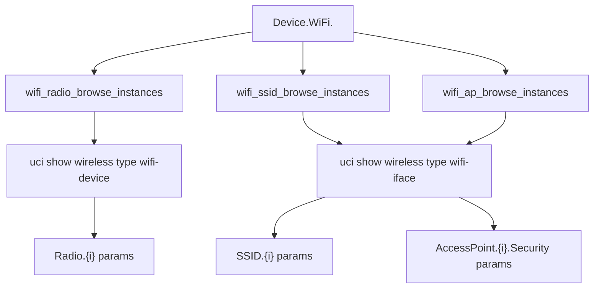

---

## 12. Cau hinh hien tai tren board

### 12.1. EasyCwmp config

```sh
easycwmp.@local[0].enable='1'
easycwmp.@local[0].interface='br-lan'
easycwmp.@local[0].port='7547'
easycwmp.@local[0].ubus_socket='/var/run/ubus.sock'
easycwmp.@local[0].username='easycwmp'
easycwmp.@local[0].authentication='Digest'
easycwmp.@local[0].logging_level='3'
easycwmp.@acs[0].url='http://192.168.2.144:7547'
easycwmp.@acs[0].username='admin'
easycwmp.@acs[0].password='admin'
easycwmp.@acs[0].periodic_enable='1'
easycwmp.@acs[0].periodic_interval='100'
easycwmp.@device[0].oui='FFFFFF'
easycwmp.@device[0].product_class='Generic'
easycwmp.@device[0].serial_number='FFFFFF123456'
```

### 12.2. Device ID tren ACS

Tu config:

```text
OUI = FFFFFF
ProductClass = Generic
SerialNumber = FFFFFF123456
```

Device ID tren GenieACS:

```text
FFFFFF-Generic-FFFFFF123456
```

---

## 13. Cac van de runtime da phat hien

### 13.1. ConnectionRequestURL rong

Nguyen nhan:

- Script tao ConnectionRequestURL bang interface trong `easycwmp.@local[0].interface`.
- Neu config la `lan`, nhung Linux interface thuc te la `br-lan`, script khong lay duoc IP.

Cach sua:

```sh
uci set easycwmp.@local[0].interface='br-lan'
uci commit easycwmp
/etc/init.d/easycwmpd restart
```

### 13.2. GenieACS bao invalid Connection Request URL

Nguyen nhan:

- `Device.ManagementServer.ConnectionRequestURL` rong hoac ACS khong truy cap duoc URL.

Kiem tra:

```sh
easycwmp get Device.ManagementServer.ConnectionRequestURL
curl -v http://192.168.2.1:7547/
```

Neu curl GET tra `405 Method Not Allowed` tu ACS thi la ACS endpoint, con voi Connection Request URL cua board thi can auth Digest/Basic theo config.

### 13.3. Set parameter xong bi doi lai

Nguyen nhan:

- GenieACS provision co the ghi de parameter moi lan Inform.

Vi du provision set:

```js
declare("Device.ManagementServer.PeriodicInformInterval", {value: daily}, {value: informInterval});
```

Ket luan:

- EasyCwmp set duoc, nhung ACS provision ghi lai value khac.
- Khi test set/get can tam thoi disable provision hoac tao provision rieng.

### 13.4. DHCPv4 khong browse instance khi dung sai UCI option

Ban dau script dung:

```sh
$UCI_SHOW -X dhcp
```

Neu `UCI_SHOW="/sbin/uci -q show"` thi command thanh:

```sh
/sbin/uci -q show -X dhcp
```

Mot so ban OpenWrt khong chap nhan option `-X` sau `show`. Ban runtime hien tai da co helper:

```sh
UCI_SHOW_1="/sbin/uci -q -X ${UCI_CONFIG_DIR:+-c $UCI_CONFIG_DIR} show"
```

Va `dhcpv4` da dung:

```sh
$UCI_SHOW_1 dhcp
```

Ket qua hien tai:

```text
Device.DHCPv4.Server.Pool.1.
Device.DHCPv4.Server.Pool.2.
```

---

## 14. Test plan tong the

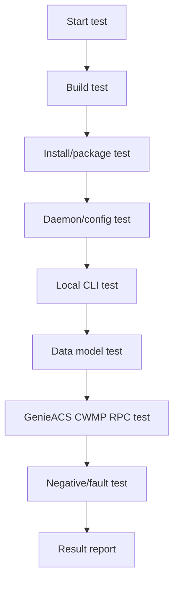

---

## 15. Test cases

### 15.1. Build test cases

| ID | Muc tieu | Buoc test | Expected result |
|---|---|---|---|
| TC-BUILD-01 | Kiem tra source tree | `cd /home/tungnt254/Documents/Fasttrack_mock/openwrt && pwd` | Dung OpenWrt source path |
| TC-BUILD-02 | Kiem tra package EasyCwmp | `ls package/easycwmp` | Co `Makefile`, `Config.in`, `patches` |
| TC-BUILD-03 | Kiem tra package libmicroxml | `ls package/libs/libmicroxml` | Co `Makefile`, `Config.in` |
| TC-BUILD-04 | Build libmicroxml | `make package/libs/libmicroxml/compile V=s -j1` | Build thanh cong |
| TC-BUILD-05 | Build EasyCwmp | `make package/easycwmp/compile V=s -j1` | Tao `.ipk` easycwmp |
| TC-BUILD-06 | Build full firmware | `make -j$(nproc)` | Tao firmware trong `bin/targets/...` |
| TC-BUILD-07 | Verify package output | `find bin/packages -name '*easycwmp*.ipk' -o -name '*microxml*.ipk'` | Co easycwmp va libmicroxml |

### 15.2. Install/runtime test cases

| ID | Muc tieu | Buoc test | Expected result |
|---|---|---|---|
| TC-RUN-01 | Kiem tra package installed | `opkg list-installed | grep easycwmp` | Co `easycwmp - 1.8.6` |
| TC-RUN-02 | Kiem tra file package | `opkg files easycwmp` | Co daemon, script, functions |
| TC-RUN-03 | Kiem tra process | `ps | grep easycwmpd | grep -v grep` | Co `/usr/sbin/easycwmpd -f --boot` |
| TC-RUN-04 | Restart daemon | `/etc/init.d/easycwmpd restart` | Khong bao loi |
| TC-RUN-05 | Kiem tra log | `logread | grep -i easycwmp | tail -50` | Co log start/inform/session |
| TC-RUN-06 | Kiem tra port local | `netstat -lntp | grep 7547` | Board listen Connection Request port |

### 15.3. Local CLI action test cases

| ID | Action | Lenh test | Expected result |
|---|---|---|---|
| TC-CLI-01 | `get name` | `easycwmp get name Device. 0` | Liet ke object/parameter |
| TC-CLI-02 | `get value` | `easycwmp get Device.ManagementServer.URL` | Tra value ACS URL |
| TC-CLI-03 | `set value` | `easycwmp set value Device.ManagementServer.PeriodicInformInterval 100` | Khong fault |
| TC-CLI-04 | `apply value` | `easycwmp apply value` | Commit UCI/status OK |
| TC-CLI-05 | `get notification` | `easycwmp get notification Device.WiFi.SSID.1.SSID` | Tra notification value |
| TC-CLI-06 | `set notification` | `easycwmp set notification Device.WiFi.SSID.1.SSID 1` | Khong fault |
| TC-CLI-07 | `apply notification` | `easycwmp apply notification` | Apply thanh cong |
| TC-CLI-08 | `inform parameter` | `easycwmp inform parameter` | Tra forced inform parameters |
| TC-CLI-09 | `inform device_id` | `easycwmp inform device_id` | Tra manufacturer/OUI/product/serial |
| TC-CLI-10 | invalid parameter | `easycwmp get Device.NotExist.Param` | Tra fault `9005` |

### 15.4. ManagementServer test cases

| ID | Parameter | Lenh test | Expected result |
|---|---|---|---|
| TC-MS-01 | URL | `easycwmp get Device.ManagementServer.URL` | `http://192.168.2.144:7547` |
| TC-MS-02 | Username | `easycwmp get Device.ManagementServer.Username` | `admin` |
| TC-MS-03 | Periodic enable | `easycwmp get Device.ManagementServer.PeriodicInformEnable` | `1` |
| TC-MS-04 | Periodic interval | `easycwmp get Device.ManagementServer.PeriodicInformInterval` | `100` hoac value da set |
| TC-MS-05 | ConnectionRequestURL | `easycwmp get Device.ManagementServer.ConnectionRequestURL` | `http://192.168.2.1:7547/` |
| TC-MS-06 | Set interval | `easycwmp set value Device.ManagementServer.PeriodicInformInterval 120; easycwmp apply value` | UCI interval doi sang `120` |
| TC-MS-07 | Set ACS URL | `easycwmp set value Device.ManagementServer.URL http://192.168.2.144:7547; easycwmp apply value` | UCI URL duoc cap nhat |

### 15.5. DeviceInfo test cases

| ID | Parameter | Lenh test | Expected result |
|---|---|---|---|
| TC-DI-01 | SpecVersion | `easycwmp get Device.DeviceInfo.SpecVersion` | `1.0` |
| TC-DI-02 | Manufacturer | `easycwmp get Device.DeviceInfo.Manufacturer` | Gia tri tu config |
| TC-DI-03 | OUI | `easycwmp get Device.DeviceInfo.ManufacturerOUI` | `FFFFFF` |
| TC-DI-04 | ProductClass | `easycwmp get Device.DeviceInfo.ProductClass` | `Generic` |
| TC-DI-05 | SerialNumber | `easycwmp get Device.DeviceInfo.SerialNumber` | `FFFFFF123456` |
| TC-DI-06 | UpTime | `easycwmp get Device.DeviceInfo.UpTime` | So giay uptime |
| TC-DI-07 | MemoryStatus | `easycwmp get Device.DeviceInfo.MemoryStatus.` | Co Total/Free |

### 15.6. DHCPv4 test cases

| ID | Muc tieu | Lenh test | Expected result |
|---|---|---|---|
| TC-DHCP-01 | Get names | `easycwmp get name Device.DHCPv4. 0` | Co Server va Pool |
| TC-DHCP-02 | Get server enable | `easycwmp get Device.DHCPv4.Server.Enable` | `1` neu dnsmasq enable |
| TC-DHCP-03 | Browse pool | `easycwmp get name Device.DHCPv4.Server.Pool. 0` | Co Pool.1 va Pool.2 |
| TC-DHCP-04 | Pool 1 values | `easycwmp get Device.DHCPv4.Server.Pool.1.` | Co Min/Max/Subnet/Lease |
| TC-DHCP-05 | Pool 1 min | `easycwmp get Device.DHCPv4.Server.Pool.1.MinAddress` | Khoang DHCP start |
| TC-DHCP-06 | Pool 1 max | `easycwmp get Device.DHCPv4.Server.Pool.1.MaxAddress` | Khoang DHCP end |
| TC-DHCP-07 | Pool 1 lease | `easycwmp get Device.DHCPv4.Server.Pool.1.LeaseTime` | Lease time |
| TC-DHCP-08 | Disable pool | `easycwmp set value Device.DHCPv4.Server.Pool.1.Enable false; easycwmp apply value` | `dhcp.lan.ignore=1` |
| TC-DHCP-09 | Enable pool | `easycwmp set value Device.DHCPv4.Server.Pool.1.Enable true; easycwmp apply value` | `dhcp.lan.ignore` bi clear/false |
| TC-DHCP-10 | Add object | `easycwmp add object Device.DHCPv4.Server.Pool.; easycwmp apply object` | Tao section DHCP moi, tra instance |
| TC-DHCP-11 | Delete object | `easycwmp delete object Device.DHCPv4.Server.Pool.<i>.; easycwmp apply object` | Xoa section DHCP tuong ung |

Luu y: TC-DHCP-08 den TC-DHCP-11 co the anh huong network, can backup `/etc/config/dhcp` truoc khi test.

### 15.7. IP data model test cases

| ID | Muc tieu | Lenh test | Expected result |
|---|---|---|---|
| TC-IP-01 | Get names | `easycwmp get name Device.IP. 0` | Co Interface va IPPing |
| TC-IP-02 | Browse interface | `easycwmp get name Device.IP.Interface. 0` | Co Interface.1 va Interface.2 |
| TC-IP-03 | Get LAN IP | `easycwmp get Device.IP.Interface.2.IPv4Address.1.IPAddress` | `192.168.2.1` |
| TC-IP-04 | Get subnet | `easycwmp get Device.IP.Interface.2.IPv4Address.1.SubnetMask` | `255.255.255.0` |
| TC-IP-05 | Get stats | `easycwmp get Device.IP.Interface.2.Stats.` | Co Bytes/Packets/Errors |
| TC-IP-06 | Set IP | `easycwmp set value Device.IP.Interface.2.IPv4Address.1.IPAddress 192.168.2.1; easycwmp apply value` | Khong doi neu set cung value |

### 15.8. IPPingDiagnostics test cases

| ID | Muc tieu | Lenh test | Expected result |
|---|---|---|---|
| TC-PING-01 | Get names | `easycwmp get name Device.IP.Diagnostics.IPPing. 0` | Co diagnostic params |
| TC-PING-02 | Set Host | `easycwmp set value Device.IP.Diagnostics.IPPing.Host 8.8.8.8` | Khong fault |
| TC-PING-03 | Set repetitions | `easycwmp set value Device.IP.Diagnostics.IPPing.NumberOfRepetitions 4` | Khong fault |
| TC-PING-04 | Set timeout | `easycwmp set value Device.IP.Diagnostics.IPPing.Timeout 1000` | Khong fault |
| TC-PING-05 | Start diagnostic | `easycwmp set value Device.IP.Diagnostics.IPPing.DiagnosticsState Requested; easycwmp apply value` | Diagnostic bat dau |
| TC-PING-06 | Get result | `easycwmp get Device.IP.Diagnostics.IPPing.` | Co SuccessCount/FailureCount/RTT |
| TC-PING-07 | Negative host | Set host `192.0.2.1`, start diagnostic | FailureCount tang hoac state bao loi |

### 15.9. WiFi test cases

| ID | Muc tieu | Lenh test | Expected result |
|---|---|---|---|
| TC-WIFI-01 | Get names | `easycwmp get name Device.WiFi. 0` | Co Radio/SSID/AP |
| TC-WIFI-02 | Get radio | `easycwmp get Device.WiFi.Radio.1.` | Co Enable/Status/Channel |
| TC-WIFI-03 | Set channel | `easycwmp set value Device.WiFi.Radio.1.Channel 6; easycwmp apply value` | UCI wireless channel doi |
| TC-WIFI-04 | Set auto channel | `easycwmp set value Device.WiFi.Radio.1.AutoChannelEnable true; easycwmp apply value` | Wireless config doi |
| TC-WIFI-05 | Get SSID | `easycwmp get Device.WiFi.SSID.1.SSID` | Tra ten SSID |
| TC-WIFI-06 | Set SSID | `easycwmp set value Device.WiFi.SSID.1.SSID TestSSID; easycwmp apply value` | SSID doi |
| TC-WIFI-07 | AP security mode | `easycwmp get Device.WiFi.AccessPoint.1.Security.ModeEnabled` | Tra security mode |
| TC-WIFI-08 | Set passphrase | `easycwmp set value Device.WiFi.AccessPoint.1.Security.KeyPassphrase test12345; easycwmp apply value` | Key duoc cap nhat |

Luu y: Test WiFi co the lam mat ket noi client dang dung WiFi. Nen test qua Ethernet/serial hoac co rollback.

### 15.10. GenieACS/CWMP test cases

| ID | Muc tieu | Cach test | Expected result |
|---|---|---|---|
| TC-ACS-01 | Device online | Restart daemon hoac doi periodic interval | GenieACS thay device online |
| TC-ACS-02 | Inform | `logread | grep -i Inform` | Co log send Inform/InformResponse |
| TC-ACS-03 | Connection Request | Click refresh/get tu GenieACS | Board tao session moi |
| TC-ACS-04 | GetParameterValues | Tao task get `Device.ManagementServer.URL` | Task complete va co value |
| TC-ACS-05 | SetParameterValues | Tao task set `PeriodicInformInterval=120` | Board log nhan SetParameterValues |
| TC-ACS-06 | GetParameterNames | Tao task get names `Device.WiFi.` | ACS nhan list params |
| TC-ACS-07 | GetParameterAttributes | ACS get attributes WiFi SSID | Co notification attr |
| TC-ACS-08 | SetParameterAttributes | ACS set passive notification cho SSID | UCI notification cap nhat |
| TC-ACS-09 | AddObject | ACS add `Device.DHCPv4.Server.Pool.` | Neu script support, tra instance |
| TC-ACS-10 | DeleteObject | ACS delete pool instance test | Xoa object hoac tra fault hop le |
| TC-ACS-11 | Download config | ACS Download file type `3 Vendor Configuration File` | Download/apply hoac fault hop le |
| TC-ACS-12 | Upload log | ACS Upload `Vendor Log File` | Upload log hoac fault hop le |
| TC-ACS-13 | Reboot | ACS Reboot | Board reboot sau response |
| TC-ACS-14 | FactoryReset | ACS FactoryReset | Board reset sau response |
| TC-ACS-15 | ScheduleInform | ACS ScheduleInform delay 30s | Sau delay board inform lai |

Mau NBI get:

```sh
curl -X POST \
  'http://192.168.2.144:7557/devices/FFFFFF-Generic-FFFFFF123456/tasks?connection_request' \
  -H 'Content-Type: application/json' \
  --data '{"name":"getParameterValues","parameterNames":["Device.ManagementServer.URL"]}'
```

Mau NBI set:

```sh
curl -X POST \
  'http://192.168.2.144:7557/devices/FFFFFF-Generic-FFFFFF123456/tasks?connection_request' \
  -H 'Content-Type: application/json' \
  --data '{"name":"setParameterValues","parameterValues":[["Device.ManagementServer.PeriodicInformInterval",120,"xsd:unsignedInt"]]}'
```

### 15.11. Download/Upload/Reboot/FactoryReset safety test cases

| ID | Muc tieu | Lenh/cach test | Expected result |
|---|---|---|---|
| TC-SAFE-01 | Download invalid URL | ACS Download URL khong ton tai | Fault download |
| TC-SAFE-02 | Upload invalid URL | ACS Upload toi URL khong ton tai | Fault upload |
| TC-SAFE-03 | Reboot dry-run | Chi test khi co quyen downtime | Board reboot |
| TC-SAFE-04 | FactoryReset dry-run | Khong nen chay tren board dang dung | Neu chay, board reset config |

---

## 16. Checklist nghiem thu

| Hang muc | Trang thai mong doi |
|---|---|
| Build `libmicroxml` | Pass |
| Build `easycwmp` | Pass |
| Build firmware OpenWrt | Pass |
| Package installed tren board | Pass |
| Daemon running | Pass |
| `Device.` root names | Pass |
| ManagementServer get/set | Pass |
| DeviceInfo get | Pass |
| DHCPv4 Pool.1/Pool.2 browse | Pass |
| IP Interface.1/2 browse | Pass |
| WiFi Radio/SSID/AP browse | Pass |
| IPPingDiagnostics start/get result | Pass |
| GenieACS Inform | Pass |
| GenieACS GetParameterValues | Pass |
| GenieACS SetParameterValues | Pass, neu provision khong ghi de |
| Connection Request | Pass, neu URL/auth dung |

---

## 17. Phu luc lenh nhanh

### 17.1. Board smoke test

```sh
opkg list-installed | grep easycwmp
ps | grep easycwmpd | grep -v grep
easycwmp get name Device. 0
easycwmp get Device.ManagementServer.ConnectionRequestURL
easycwmp get Device.DeviceInfo.
easycwmp get Device.DHCPv4.
easycwmp get Device.IP.
easycwmp get Device.WiFi.
```

### 17.2. Restart va log

```sh
/etc/init.d/easycwmpd restart
logread | grep -i easycwmp | tail -100
```

### 17.3. DHCP verify

```sh
uci -q show dhcp | grep 'dhcp\..*=dhcp'
easycwmp get name Device.DHCPv4.Server.Pool. 0
```

### 17.4. Config ACS

```sh
uci set easycwmp.@acs[0].url='http://192.168.2.144:7547'
uci set easycwmp.@acs[0].username='admin'
uci set easycwmp.@acs[0].password='admin'
uci set easycwmp.@local[0].interface='br-lan'
uci commit easycwmp
/etc/init.d/easycwmpd restart
```

---

## 18. Ket luan

Project da hoan thanh viec dua EasyCwmp vao source OpenWrt, xu ly cac loi build thuc te va kiem thu thanh cong tren board OpenWrt. Bao cao cho thay EasyCwmp khong chi la mot daemon C ma con phu thuoc lon vao he thong shell data model scripts de map TR-181 sang UCI/ubus cua OpenWrt.

Qua project, cac ket qua quan trong gom:

- Hieu duoc OpenWrt package flow cho phan mem autotools.
- Biet cach them thu vien phu thuoc `libmicroxml`.
- Biet cach debug loi `autoreconf` bi che boi build system.
- Biet cach EasyCwmp giao tiep voi script data model qua JSON pipe.
- Biet cach GenieACS tao task get/set va Connection Request.
- Xay dung duoc bo test case phu hop voi tat ca chuc nang EasyCwmp da import trong source.

Huong phat trien tiep theo:

- Hoan thien them data model TR-181 con thieu.
- Viet automated test script cho local CLI va GenieACS NBI.
- Dong goi patch DHCPv4/WiFi instance browse vao source package thay vi sua runtime.
- Bo sung HTTPS ACS, authentication policy va secure credential handling.

